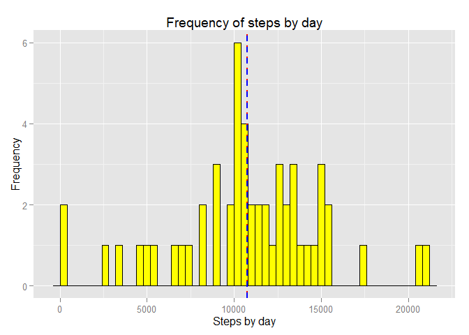
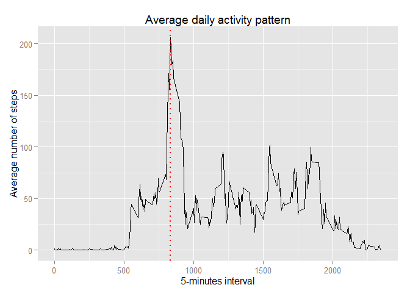
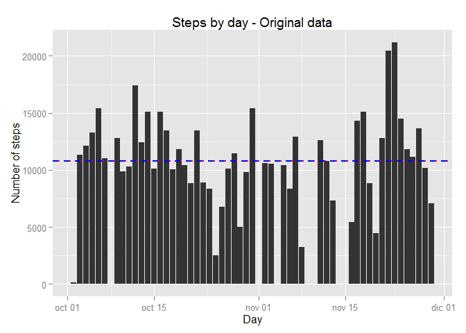
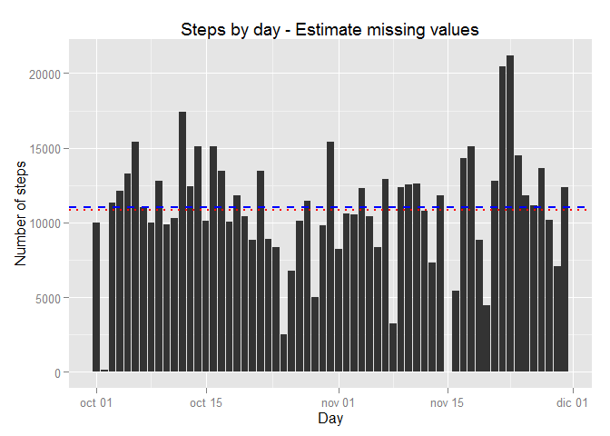
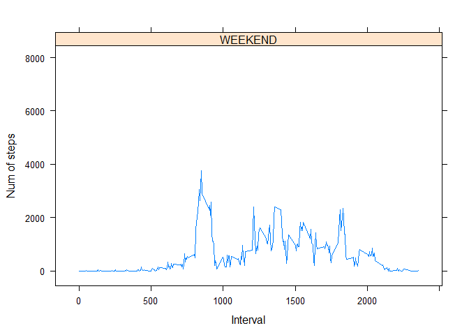
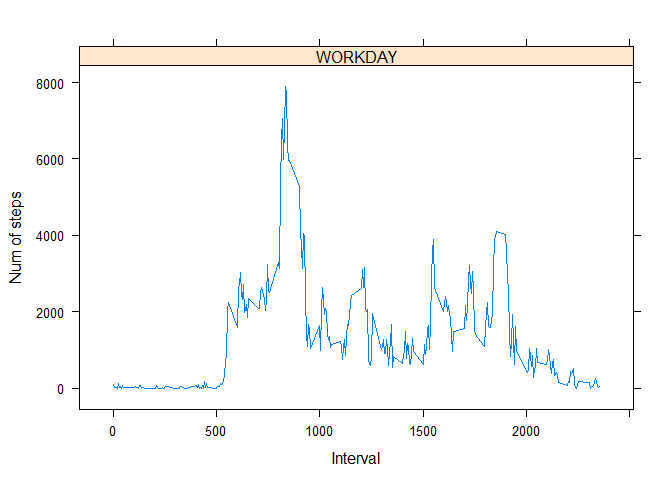

# Reproducible Research: Peer Assessment 1


## Loading and preprocessing the data
- Load the data (i.e. read.csv())
- Process/transform the data (if necessary) into a format suitable for your analysis

Set work directory, download the file and load data in activityData 

```r
# Set work directory
setwd("G:/Curso")
# Load libraries for plot
library(ggplot2)
library(lattice)
# Load library lubridate to obtain the number of day of the week
library(lubridate)
# Download the file and unziped it
fileUrl <- "http://d396qusza40orc.cloudfront.net/repdata%2Fdata%2Factivity.zip"
download.file(fileUrl, "Factivity.zip", mode="wb")
unzip("Factivity.zip")
# Extract data from file
activityData <- read.table("activity.csv", header = TRUE, 
                           sep = ",", na.strings = "NA")
```

## What is mean total number of steps taken per day?
For this part of the assignment, you can ignore the missing values in the dataset.


```r
# SUM steps by date
stepsByDay <- aggregate(steps~as.Date(date), activityData, F=sum, na.rm = TRUE)
# Rename columns names
stepsByDay <- setNames(stepsByDay,c("date","steps"))
```

1. Make a histogram of the total number of steps taken each day


```r
# First calculate mean and median to show it in the histogram
meanSteps <- mean(stepsByDay$steps,na.rm = TRUE) 
medianSteps <- median(stepsByDay$steps,na.rm = TRUE) 

ggp <- ggplot(stepsByDay,aes(x=steps)) +
        geom_histogram(fill = "yellow", colour = "black", binwidth=400)  +
        labs(x = "Steps by day", y = "Frequency", title="Frequency of steps by day") +
        geom_vline(xintercept = meanSteps, color = "red",linetype = "dotted", size = 1) + 
        geom_vline(xintercept = medianSteps, color = "blue",linetype = "dashed", size = 1)
print(ggp)
```

 

2. Calculate and report the mean and median total number of steps taken per day

```r
# Show mean of steps taken per day calculated un the previous step
print(paste('Mean: ', meanSteps),quote=FALSE)
```

```
## [1] Mean:  10766.1886792453
```

```r
# Show median of steps taken per day calculated un the previous step
print(paste('Median: ', medianSteps),quote=FALSE)
```

```
## [1] Median:  10765
```

## What is the average daily activity pattern?

1. Make a time series plot (i.e. type = "l") of the 5-minute interval (x-axis) 
and the average number of steps taken, averaged across all days (y-axis)


```r
# Quit NA Values
activityDataClear <- activityData[!is.na(as.character(activityData$steps)),]

# SUM steps by date
stepsByInterval <- aggregate(activityDataClear$steps, 
                             by=list(interval=activityDataClear$interval), 
                             F=mean)
# Rename columns names
stepsByInterval <- setNames(stepsByInterval,c("interval","steps"))

#Calculate max value
maxSteps <- stepsByInterval[which.max(stepsByInterval$steps), ]$interval

# Plots data, marking interval with max number of steps
plotSteps <- ggplot(stepsByInterval,aes(x=interval,y=steps)) + 
        geom_line() +
        labs(x = "5-minutes interval", y = "Average number of steps", 
             title="Average daily activity pattern") +
        geom_vline(xintercept = maxSteps, color = "red",linetype = "dotted", size = 1)

print(plotSteps)
```

 

2. Which 5-minute interval, on average across all the days in the dataset, 
contains the maximum number of steps?

```r
# Format interval hour
formatMaxSteps <- paste(substr(sprintf("%04d", maxSteps),1,2),separate=":",
                        substr(sprintf("%04d", maxSteps),3,4),sep="")
# Show interval with max number of steps
print(paste('Interval with max number of steps: ', formatMaxSteps),quote=FALSE)
```

```
## [1] Interval with max number of steps:  08:35
```

## Imputing missing values
Note that there are a number of days/intervals where there are missing values (coded as NA).

The presence of missing days may introduce bias into some calculations or summaries of the data.

1. Calculate and report the total number of missing values in the dataset (i.e. the total number of rows with NAs)

```r
# Obtain steps missing values
nullSteps <- sum(is.na(as.character(activityData$steps)))
# Show number of steps missing values
print(paste('Number of steps missing values: ', nullSteps),quote=FALSE)
```

```
## [1] Number of steps missing values:  2304
```

```r
# Obtain interval missing values
nullInterval <- sum(is.na(as.character(activityData$interval)))
# Show number of interval missing values
print(paste('Number of interval missing values: ', nullInterval),quote=FALSE)
```

```
## [1] Number of interval missing values:  0
```

```r
# Obtain date missing values
nullDate <- sum(is.na(as.character(activityData$date)))
# Show number of date missing values
print(paste('Number of date missing values: ', nullDate),quote=FALSE)
```

```
## [1] Number of date missing values:  0
```


2. Devise a strategy for filling in all of the missing values in the dataset. The strategy does not need to be sophisticated. For example, you could use the mean/median for that day, or the mean for that 5-minute interval, etc.

*I use the mean by week day and interval, to calculate missing values *

```r
# Obtain the mean by week day and interval when there is no missing values
activityMeans <- aggregate(steps~interval+wday(date),activityData,FUN=mean,na.rm=TRUE)

# Rename columns names
activityMeans <- setNames(activityMeans,c("interval","wday","steps"))
```

3. Create a new dataset that is equal to the original dataset but with the missing data filled in.

```r
# Copy data for fill missing values with estimate date
activityCleanData <- activityData
for (i in 1:nrow(activityData)){
        if(is.na(activityData$steps[i])){
                activityCleanData$steps[i] <- activityMeans[
                                activityMeans$interval==activityCleanData$interval[i] & 
                                activityMeans$wday == wday(activityCleanData$date[i]),]$steps
        }
}
```

4. Make a histogram of the total number of steps taken each day and Calculate and report the mean and median total number of steps taken per day. 

```r
# SUM steps by date with 
stepsByDayEst <- aggregate(steps~as.Date(date), activityCleanData, F=sum, na.rm = TRUE)
# Rename columns names
stepsByDayEst <- setNames(stepsByDayEst,c("date","steps"))

# First calculate mean and median to show it in the histogram
meanStepsEst <- mean(stepsByDayEst$steps,na.rm = TRUE) 
medianStepsEst <- median(stepsByDayEst$steps,na.rm = TRUE) 

# Histogram with original data
ggp2 <- ggplot(stepsByDay,aes(x=date,y=steps)) +
        geom_histogram(fill = "yellow", colour = "black")  +
        geom_bar(stat="identity") + 
        labs(x = "Day", y = "Number of steps", 
            title="Steps by day - Original data") +
        geom_hline(yintercept = meanSteps, color = "red",
                   linetype = "dotted", size = 1) + 
        geom_hline(yintercept = medianSteps, color = "blue",
                   linetype = "dashed", size = 1)

# Histogram with estimate data
ggp2Est <- ggplot(stepsByDayEst,aes(x=date,y=steps)) +
        geom_histogram(fill = "yellow", colour = "black")  +
        geom_bar(stat="identity") + 
        labs(x = "Day", y = "Number of steps", 
             title="Steps by day - Estimate missing values") +
        geom_hline(yintercept = meanStepsEst, color = "red",
                   linetype = "dotted", size = 1) + 
        geom_hline(yintercept = medianStepsEst, color = "blue",
                   linetype = "dashed", size = 1)

#Print both histograms
print(ggp2)
```

 

```r
print(ggp2Est)
```

 

   Do these values differ from the estimates from the first part of the assignment? 

```r
print('Original data summary: ',quote=FALSE)
```

```
## [1] Original data summary:
```

```r
summary(stepsByDay$steps)
```

```
##    Min. 1st Qu.  Median    Mean 3rd Qu.    Max. 
##      41    8841   10760   10770   13290   21190
```

```r
print('Estimate data summary: ',quote=FALSE)
```

```
## [1] Estimate data summary:
```

```r
summary(stepsByDayEst$steps)
```

```
##    Min. 1st Qu.  Median    Mean 3rd Qu.    Max. 
##      41    8918   11020   10820   12810   21190
```

   What is the impact of imputing missing data on the estimates of the total daily number of steps?
*The mean and median have increse because we are estimated missin vales*

## Are there differences in activity patterns between weekdays and weekends?
1.  Create a new factor variable in the dataset with two levels - "weekday" and "weekend" indicating whether a given date is a weekday or weekend day.

```r
# Add a new variable that say if the steps by interval are in weekday or weekend
activityData$weekday <- ifelse(!( wday(activityData$date) %in% c(6,7)), "WORKDAY", "WEEKEND") 
# SUM steps by interval and type of day
stepsByWeekDay <- aggregate(steps~interval+weekday, activityData, F=sum, na.rm = TRUE)
```

2.	Make a panel plot containing a time series plot (i.e. type = "l") of the 5-minute interval (x-axis) and the average number of steps taken, averaged across all weekday days or weekend days (y-axis). 

```r
# Show two plots with the data
xyplot(stepsByWeekDay$steps ~ stepsByWeekDay$interval | stepsByWeekDay$weekday, 
       layout = c(1,1), type = "l", ylab = "Num of steps", xlab = "Interval")
```

  
